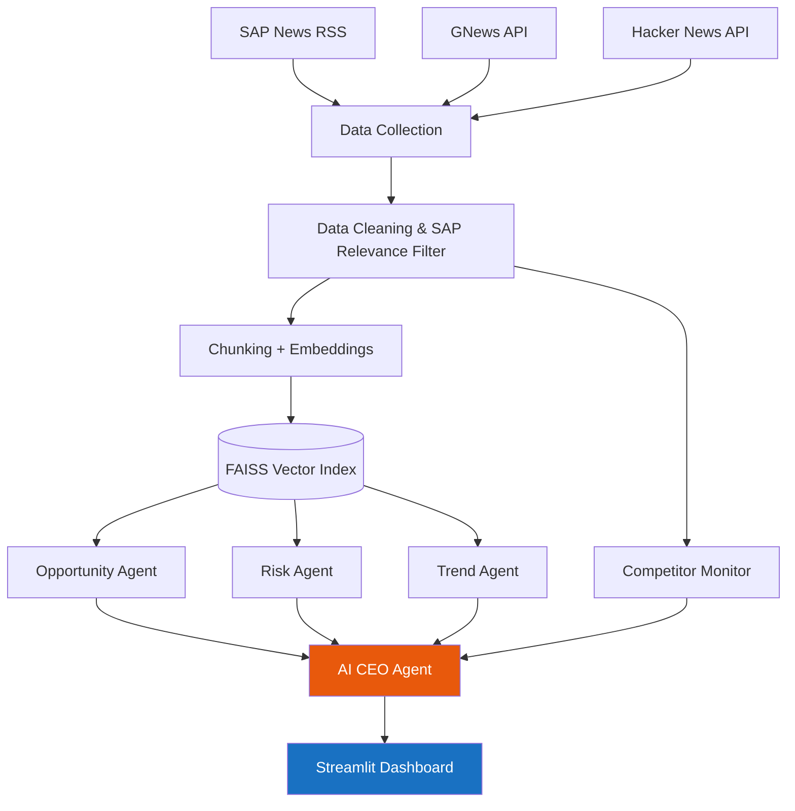
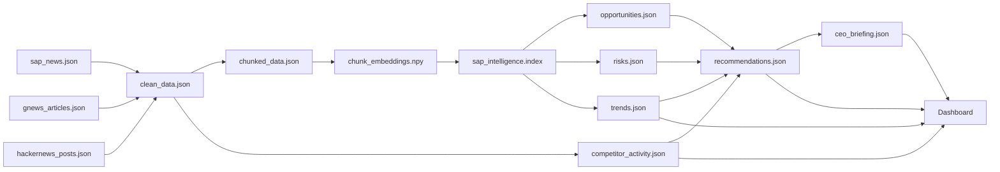

# AI CEO Strategic Intelligence Agent

A retrieval-augmented intelligence system that monitors public news about SAP and
answers one question: **if you were the CEO today, what would you do next, and why?**

It collects live news from three sources, cleans and indexes it, runs four
specialist agents over it (opportunities, risks, trends, competitor activity),
and feeds those results into a CEO agent that produces prioritized,
evidence-backed recommendations - all displayed on an executive dashboard.

Every reasoning step runs on a **local, open-source LLM via Ollama**
(`phi4-mini` by default) - no Anthropic, OpenAI, or Gemini API calls anywhere
in the pipeline.

## System Architecture



## Data Flow



## Technology Stack

| Layer | Choice | Why |
|---|---|---|
| Data collection | `feedparser`, `newspaper3k`, GNews API, HN Algolia API | No API key needed for SAP News or HN; covers 3 independent source types |
| Data cleaning | `pandas`, `rapidfuzz` | Standard tooling, fuzzy dedup catches rephrased duplicate headlines |
| Embeddings | `BAAI/bge-small-en-v1.5` (sentence-transformers) | Small, fast, runs on CPU, from the assignment's approved model list |
| Vector store | FAISS (`IndexFlatIP`) | Exact cosine search, no need for approximate search at ~1,400 vectors |
| LLM | Ollama, `phi4-mini` | Open-source, runs locally, CPU-friendly - required since commercial APIs are not allowed |
| Sentiment | VADER (`vaderSentiment`) | Fast, deterministic, no LLM call needed per article |
| Dashboard | Streamlit | Fastest path to an interactive executive dashboard in Python |
| Orchestration | `jupyter nbconvert --execute` via `main.ipynb` | Runs every pipeline notebook in order with one command |

## AI Pipeline (RAG + Multi-Agent)

1. **Retrieval**: each specialist agent embeds a handful of topic queries
   (e.g. "SAP competitive threats") and retrieves the top-k most similar
   chunks from the FAISS index - this is standard RAG, not a single
   end-to-end LLM call over all the data.
2. **Extraction**: the retrieved chunks are passed to `phi4-mini` with a
   prompt asking for a structured JSON list (opportunities, risks, or
   trends), with required fields (impact/severity level, evidence,
   confidence score) baked into the prompt.
3. **Synthesis**: the CEO agent does **not** re-read raw articles. It reads
   the already-extracted JSON outputs from the four specialist agents and
   reasons over that summary - the same way a CEO reads analyst briefings
   rather than every news article personally.
4. **Output**: prioritized recommendations (`recommendations.json`) and a
   three-part executive briefing (`ceo_briefing.json`), both consumed
   directly by the dashboard.

## Design Decisions

- **One knowledge repository, not one per source.** All three sources feed
  into a single `clean_data.json` -> single FAISS index. Competitor activity
  is found by querying that same repository differently (by competitor
  name instead of by opportunity/risk framing), not via a separate database.
- **SAP relevance filter.** Early collection queries ("enterprise software",
  "business AI") pulled in articles with zero connection to SAP. Fixed by
  dropping any row that doesn't mention "SAP" as a whole word anywhere in
  the text.
- **Mixed date format bug.** SAP's RSS feed uses `Fri, 19 Jun 2026...` while
  GNews/HN use ISO 8601. `pandas.to_datetime()` without `format="mixed"`
  infers one format for the whole column and silently nulls out everything
  that doesn't match - this was nulling every non-SAP-News date until fixed.
- **VADER over LLM for sentiment.** Scoring ~250 articles individually
  through a local CPU model would be slow and non-deterministic. VADER is
  instant, consistent, and good enough for a directional sentiment view.
- **Local LLM only.** Every reasoning step (opportunity/risk/trend
  extraction, CEO synthesis) calls Ollama's REST API directly - no
  LangChain LLM wrappers, no commercial API SDKs.

## Running the Project

```bash
# one-time setup: installs Python deps + Ollama + pulls phi4-mini
bash setup.sh

# run the entire pipeline end to end
jupyter nbconvert --to notebook --execute --inplace main.ipynb

# launch the dashboard
streamlit run app.py
```

Or open `main.ipynb` and run it cell by cell to see each stage's output.

## Project Structure

```
01_Data_Collection_cleaned/   - data collection notebooks (SAP News, GNews, HN)
notebook/
  data_cleaning.ipynb         - merges + cleans the 3 raw sources
  embedding_v2.ipynb          - chunking, embeddings, FAISS index
  data/                       - all generated JSON/index files live here
agents/
  01_opportunity_agent.ipynb
  02_risk_agent.ipynb
  03_trend_agent.ipynb
  04_competitor_monitor.ipynb
  05_ceo_agent.ipynb          - synthesizes the 4 outputs above
app.py                        - Streamlit dashboard (7 sections)
main.ipynb                    - runs the whole pipeline in order
setup.sh                      - installs deps + Ollama + pulls the model
```
